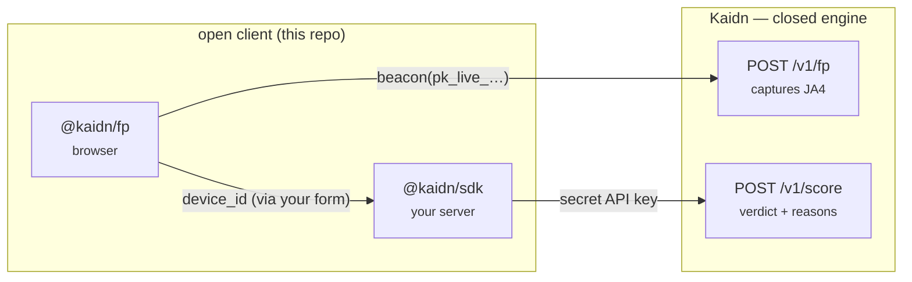

# kaidn-js

Official JavaScript / TypeScript client libraries for [**Kaidn**](https://kaidn.io) — the AI
fraud-scoring API. *Rules catch it, AI explains it.*

| Package | What it is | Runs in |
| --- | --- | --- |
| [`@kaidn/sdk`](./packages/sdk) | Server-side API client — score events, run checks, batch, lists, labels, analytics, config. | Node 18+ (your backend) |
| [`@kaidn/fp`](./packages/fp) | Browser device-fingerprint client — stable `device_id` + automation signals + JA4 beacon. | The browser |

```bash
npm install @kaidn/sdk   # server
npm install @kaidn/fp    # browser
```

## What's in this repo

```
kaidn-js/
├─ packages/
│  ├─ sdk/          @kaidn/sdk  — the published server library (source + tests)
│  │  └─ examples/  copy-paste usage snippets
│  └─ fp/           @kaidn/fp   — the published browser library (source + tests)
│     └─ examples/  copy-paste usage snippets
├─ playground/      a small local app to try both libraries with your own keys
│  ├─ server.mjs    localhost server (serves the pages, proxies /score via the SDK)
│  └─ public/       the two playground pages (Score + Fingerprint)
└─ .env.example     where your keys go — copy to .env
```

You don't need to build anything to read the code: **`packages/*/src`** is the library
source, **`packages/*/examples`** are minimal snippets, and **`playground/`** is a runnable
app. Consumers just `npm install` the packages from npm — this repo is for reading,
examples, and the playground.

## Running things (and where your API key goes)

The packages are **libraries** — you don't "run" a library, you install it and call it.
There are three ways to see them in action, in increasing order of setup:

| Command | What it does | Needs a key? |
| --- | --- | --- |
| `npm test` | Unit tests (mock API) — proves the client logic. This is the passing output you may have already seen. | **No** — uses a fake key + mocked network |
| `npm run example:score` / `example:batch` | Runs a real `.mjs` example against the **live** API and prints the verdict. | **Yes** — your `KAIDN_API_KEY` |
| `npm run playground` | Opens a local web UI to score events and test the fingerprint. | Yes (or paste it in the page) |

**Where the key goes:** copy `.env.example` → `.env` and fill it in:

```bash
cp .env.example .env      # then edit .env:  KAIDN_API_KEY=kaidn_live_…
npm install
npm run example:score     # scores a sample signup against the live API
```

> `.env` is gitignored. `npm test` needs **no** key — that's why it passes out of the box;
> it never calls the real API. Get a key from your dashboard → **API keys**.

## How they fit together



1. **`@kaidn/fp`** runs in the browser and beacons a publishable, domain-locked key
   (`pk_live_…`) to `/v1/fp` — no secret in client code. It returns a `device_id`.
2. Your form submits that `device_id` to your backend.
3. **`@kaidn/sdk`** scores the event with your **secret** API key and gets back the verdict.

The scoring **engine** is closed — this repo is the *open client*.

## Examples

- `packages/sdk/examples/` — [score a signup](./packages/sdk/examples/score-signup.mjs)
  (`npm run example:score`), [batch + lists](./packages/sdk/examples/batch-and-lists.mjs)
  (`npm run example:batch`)
- `packages/fp/examples/` — [browser beacon](./packages/fp/examples/browser-beacon.ts)
  (browser-only — try it live on the playground's **Fingerprint** page)

## Playground

A local app to try both libraries with your own keys — no code to write.

```bash
cp .env.example .env      # then fill in your keys (optional — you can also paste them in the pages)
npm install
npm run playground        # → http://127.0.0.1:8787
```

It has two pages:

- **`/` Score** — runs `/v1/score` via `@kaidn/sdk`. Fill an event (or hit **Clean user** /
  **Likely fraud**), get the verdict + reasons, and copy the `@kaidn/sdk`/cURL code. Your
  **secret** API key stays on the local server. The IP and device_id fields auto-fill.
- **`/fingerprint` Fingerprint test** — runs `@kaidn/fp` right in your browser. See your
  `device_id` and automation signals from `collect()`, and use `beacon()` with a
  **publishable** key (`pk_live_…`) to capture a JA4. _(Add `localhost` as an approved
  domain on the tracker so the beacon is allowed.)_

Keys come from `.env` (see `.env.example`) or the in-page fields.

## Develop

```bash
npm install        # installs both workspaces
npm test           # runs each package's vitest suite
npm run typecheck
```

## Docs & license

Full API reference: [kaidn.io/docs](https://kaidn.io/docs). Both packages are MIT-licensed.
