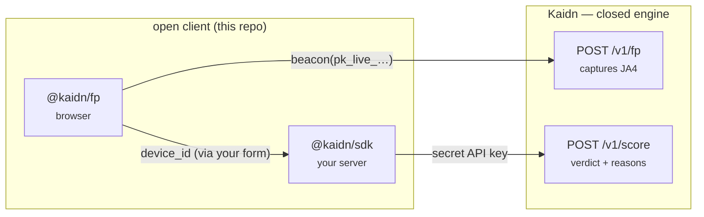

# kaidn-js

Official JavaScript / TypeScript client libraries for [**Kaidn**](https://kaidn.io) — the AI
fraud-scoring API. *Rules catch it, AI explains it.*

| Package | What it is | Runs in |
| --- | --- | --- |
| [`@kaidn/sdk`](./packages/sdk) | Server-side API client — score events, run checks, batch, lists, labels, analytics, config. | Node 18+ (your backend) |
| [`@kaidn/fp`](./packages/fp) | Browser device-fingerprint client — stable `device_id` + automation signals + JA4 beacon. | The browser |

```bash
npm install @kaidn/sdk   # server
npm install @kaidn/fp    # browser
```

## How they fit together



1. **`@kaidn/fp`** runs in the browser and beacons a publishable, domain-locked key
   (`pk_live_…`) to `/v1/fp` — no secret in client code. It returns a `device_id`.
2. Your form submits that `device_id` to your backend.
3. **`@kaidn/sdk`** scores the event with your **secret** API key and gets back the verdict.

The scoring **engine** is closed — this repo is the *open client*.

## Examples

- `packages/sdk/examples/` — [score a signup](./packages/sdk/examples/score-signup.ts),
  [batch + lists](./packages/sdk/examples/batch-and-lists.ts)
- `packages/fp/examples/` — [browser beacon](./packages/fp/examples/browser-beacon.ts)

## Develop

```bash
npm install        # installs both workspaces
npm test           # runs each package's vitest suite
npm run typecheck
```

## Docs & license

Full API reference: [kaidn.io/docs](https://kaidn.io/docs). Both packages are MIT-licensed.
